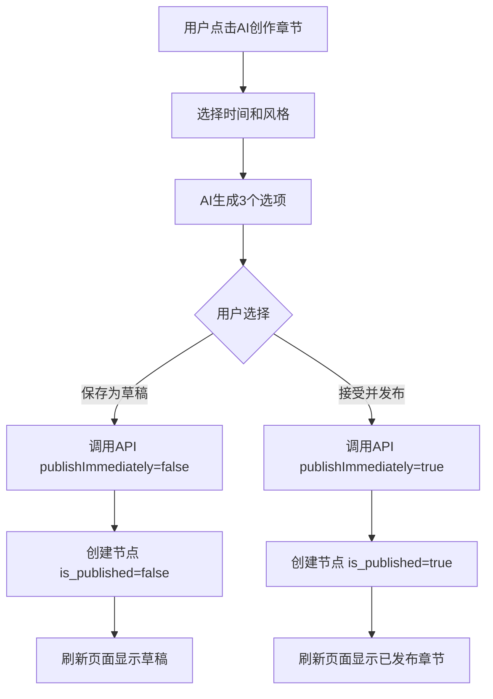

# AI章节草稿功能说明

## 📋 功能概述

AI创作章节现在支持两种保存模式：
1. **立即发布**（默认）- 创建章节并直接发布
2. **保存为草稿** - 创建章节但不发布，用户可稍后编辑并发布

---

## 🎯 使用场景

### 场景1：立即发布（默认）
用户对AI生成的内容满意，直接发布到故事中。

### 场景2：保存为草稿
用户想先保存AI生成的内容，稍后进行修改润色再发布。

---

## 🔧 技术实现

### 后端API修改

#### 1. `/api/ai/v2/continuation/accept` 接口

**新增参数：**
```typescript
{
  taskId: number,           // AI任务ID
  optionIndex: number,      // 选择的选项索引
  publishImmediately: boolean  // 是否立即发布（默认true）
}
```

**响应数据：**
```typescript
{
  node: {
    id: number,
    title: string,
    content: string,
    is_published: boolean,
    // ... 其他字段
  },
  publishStatus: 'published' | 'draft',
  message: string  // "章节已发布" 或 "章节已保存为草稿"
}
```

**代码示例：**
```typescript:api/src/routes/ai-v2.ts
router.post('/continuation/accept', async (req, res) => {
  const { taskId, optionIndex, publishImmediately = true } = req.body;
  
  // 创建节点
  const node = await prisma.nodes.create({
    data: {
      // ...
      is_published: publishImmediately, // 根据参数决定发布状态
      // ...
    }
  });
  
  res.json({ 
    node,
    publishStatus: publishImmediately ? 'published' : 'draft',
    message: publishImmediately ? '章节已发布' : '章节已保存为草稿'
  });
});
```

---

### 前端UI修改

#### 1. AI章节选项卡片

**修改前（单按钮）：**
```html
<button onclick="acceptAiChapterOption(index)">
  接受并创建章节
</button>
```

**修改后（双按钮）：**
```html
<button onclick="acceptAiChapterOption(index, false)" style="background: orange">
  <i class="fas fa-save"></i> 保存为草稿
</button>
<button onclick="acceptAiChapterOption(index, true)">
  <i class="fas fa-check"></i> 接受并发布
</button>
```

#### 2. JavaScript函数更新

```javascript:web/story.html
window.acceptAiChapterOption = async function(index, publishImmediately = true) {
  // 显示不同的加载提示
  showMessage(
    publishImmediately ? '正在创建并发布章节...' : '正在保存为草稿...', 
    'info'
  );
  
  // 调用API
  const response = await fetch('/api/ai/v2/continuation/accept', {
    method: 'POST',
    body: JSON.stringify({
      taskId: currentAiChapterTaskId,
      optionIndex: index,
      publishImmediately: publishImmediately  // 传递参数
    })
  });
  
  // 显示成功消息
  const successMessage = data.message || 
    (publishImmediately ? 'AI章节已发布！' : 'AI章节已保存为草稿！');
  showSuccess(successMessage + ' 即将刷新页面...');
};
```

---

## 📊 功能流程图



---

## 🎨 UI效果

### 按钮样式

**保存为草稿按钮：**
- 颜色：橙色渐变 (`#ffa726` → `#fb8c00`)
- 图标：`fa-save`
- 文字：保存为草稿

**接受并发布按钮：**
- 颜色：紫色渐变（原有样式）
- 图标：`fa-check`
- 文字：接受并发布

### 提示消息

| 操作 | 加载提示 | 成功提示 |
|------|---------|---------|
| 保存为草稿 | 正在保存为草稿... | AI章节已保存为草稿！即将刷新页面... |
| 接受并发布 | 正在创建并发布章节... | AI章节已发布！即将刷新页面... |

---

## 🧪 测试用例

### 测试1：保存为草稿
1. 打开AI创作章节模态框
2. 选择"立即生成"
3. 等待AI生成完成
4. 点击"保存为草稿"按钮
5. 验证：
   - ✅ 后端创建节点 `is_published=false`
   - ✅ 前端显示"已保存为草稿"提示
   - ✅ 刷新页面后，草稿章节在章节列表中显示（可能需要特殊标识）

### 测试2：接受并发布
1. 打开AI创作章节模态框
2. 选择"立即生成"
3. 等待AI生成完成
4. 点击"接受并发布"按钮
5. 验证：
   - ✅ 后端创建节点 `is_published=true`
   - ✅ 前端显示"已发布"提示
   - ✅ 刷新页面后，章节正常显示在故事树中

### 测试3：定时任务自动发布
1. 选择"1小时后"定时任务
2. 等待任务执行
3. 验证：
   - ✅ 定时任务自动创建并发布章节
   - ✅ 用户收到通知

---

## 📝 数据库字段

### nodes表

```sql
is_published BOOLEAN DEFAULT true
```

**字段说明：**
- `true` - 已发布，对所有读者可见
- `false` - 草稿状态，仅作者可见

---

## 🔄 兼容性

### 向后兼容
- 默认值 `publishImmediately = true` 保证旧代码正常工作
- 未传递该参数时，行为与之前一致（直接发布）

### 前端兼容
- 旧版本前端不传递 `publishImmediately` 参数，默认发布
- 新版本前端支持草稿和发布两种模式

---

## 🚀 后续优化建议

### 1. 草稿管理页面
添加专门的草稿管理功能：
- 查看所有草稿章节
- 编辑草稿内容
- 一键发布草稿

### 2. 草稿标识
在章节列表中标识草稿状态：
```html
<span class="draft-badge">草稿</span>
```

### 3. 草稿自动保存
编辑草稿时自动保存，避免内容丢失。

### 4. 草稿预览
发布前预览草稿效果。

---

## 📊 影响范围

### 修改的文件
1. `api/src/routes/ai-v2.ts` - 后端API
2. `web/story.html` - 前端页面

### 不影响的功能
- ✅ AI润色功能
- ✅ AI插图功能
- ✅ 定时任务功能
- ✅ 其他章节创建方式

---

## ✅ 功能验收标准

- [x] 后端API支持 `publishImmediately` 参数
- [x] 前端显示"保存为草稿"和"接受并发布"两个按钮
- [x] 点击草稿按钮，创建 `is_published=false` 的节点
- [x] 点击发布按钮，创建 `is_published=true` 的节点
- [x] 不同操作显示不同的提示消息
- [x] 刷新页面后正确显示章节状态
- [x] 保持向后兼容性

---

## 📅 更新日期

2026-03-11

## 👤 开发者

AI Assistant

