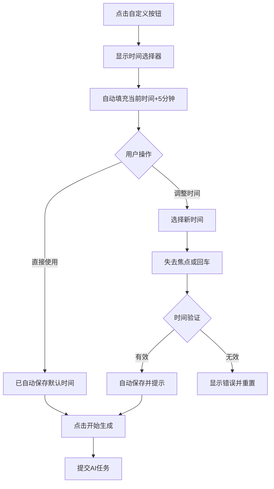

# AI创作章节-自定义时间选择器优化

## 📋 优化内容

### 优化1：默认显示当前时间+5分钟

**优化前：**
- 时间选择器显示为空或默认的浏览器时间
- 用户需要手动选择日期和时间

**优化后：**
- 自动填充当前时间+5分钟
- 用户可以直接使用默认时间，或调整到需要的时间
- 最小时间限制为当前时间+5分钟（防止选择过去的时间）

**实现代码：**
```javascript
if (selectedAiSurpriseTime === 'custom') {
    customTimeSelector.style.display = 'block';
    // 设置最小时间为当前时间+5分钟
    const now = new Date();
    now.setMinutes(now.getMinutes() + 5);
    const minDateTime = now.toISOString().slice(0, 16);
    
    const dateTimeInput = document.getElementById('customAiDateTime');
    dateTimeInput.min = minDateTime;
    // 默认显示当前时间+5分钟
    dateTimeInput.value = minDateTime;
    
    // 自动保存选中的时间
    selectedAiSurpriseTime = minDateTime;
}
```

---

### 优化2：时间选择后自动保存

**优化前：**
- 用户选择时间后，必须点击"确认"按钮才能保存
- 如果忘记点击确认，时间不会生效

**优化后：**
- 使用 `change` 事件监听时间输入框
- 用户选择时间后，失去焦点或回车即自动保存
- "确认"按钮保留但不再必须点击

**实现代码：**
```javascript
// 自定义时间输入框 - 失去焦点时自动保存
document.getElementById('customAiDateTime')?.addEventListener('change', function() {
    const customDateTime = this.value;
    if (!customDateTime) {
        showError('请选择一个时间');
        return;
    }
    
    const selectedTime = new Date(customDateTime);
    const now = new Date();
    
    if (selectedTime <= now) {
        showError('请选择未来的时间');
        // 重置为最小时间（当前+5分钟）
        now.setMinutes(now.getMinutes() + 5);
        this.value = now.toISOString().slice(0, 16);
        selectedAiSurpriseTime = this.value;
        return;
    }
    
    // 自动保存自定义时间
    selectedAiSurpriseTime = customDateTime;
    console.log('自动保存自定义时间:', selectedAiSurpriseTime);
    showSuccess('已设置自定义时间：' + selectedTime.toLocaleString('zh-CN'));
});
```

---

## 🎯 用户体验改进

### 改进前后对比

| 操作步骤 | 优化前 | 优化后 |
|---------|--------|--------|
| 1. 点击"自定义"按钮 | 显示空的时间选择器 | 显示当前时间+5分钟 |
| 2. 选择时间 | 需要手动输入日期和时间 | 可以直接使用默认值或微调 |
| 3. 保存时间 | 必须点击"确认"按钮 | 自动保存（点击外部或回车） |
| 4. 开始生成 | 点击"开始生成"按钮 | 点击"开始生成"按钮 |

---

## 🔧 技术细节

### 1. 时间格式处理

使用 `datetime-local` 输入类型：
```html
<input type="datetime-local" id="customAiDateTime">
```

时间格式转换：
```javascript
const now = new Date();
now.setMinutes(now.getMinutes() + 5);
const minDateTime = now.toISOString().slice(0, 16);
// 输出格式：2026-03-11T10:20
```

### 2. 时间验证

**最小时间限制：**
```javascript
dateTimeInput.min = minDateTime; // HTML5原生验证
```

**JavaScript验证：**
```javascript
if (selectedTime <= now) {
    showError('请选择未来的时间');
    // 重置为最小时间
    this.value = minDateTime;
}
```

### 3. 事件监听

使用 `change` 事件而非 `input` 事件：
- `change`：用户完成选择后触发（失去焦点或回车）
- `input`：每次输入都触发（太频繁）

---

## 📱 交互流程



---

## 🎨 UI效果

### 时间选择器显示

**点击"自定义"按钮后：**

```
┌─────────────────────────────────────────┐
│ 📅 自定义                               │
│ ┌─────────────────────────────────────┐ │
│ │ 2026/03/11 10:20         📅  ✓ 确认 │ │
│ └─────────────────────────────────────┘ │
└─────────────────────────────────────────┘
```

**提示消息：**
- 自动保存成功：`✅ 已设置自定义时间：2026年3月11日 10:20:00`
- 时间无效：`❌ 请选择未来的时间`

---

## 🧪 测试用例

### 测试1：默认时间显示
1. 点击"自定义"按钮
2. 验证：时间输入框显示当前时间+5分钟
3. 验证：`selectedAiSurpriseTime` 已设置为该时间

### 测试2：自动保存功能
1. 点击"自定义"按钮
2. 调整时间（例如改为1小时后）
3. 点击输入框外部或按回车
4. 验证：显示成功提示
5. 验证：`selectedAiSurpriseTime` 已更新

### 测试3：时间验证
1. 点击"自定义"按钮
2. 尝试选择过去的时间
3. 验证：显示错误提示
4. 验证：时间自动重置为最小值（当前+5分钟）

### 测试4：确认按钮兼容
1. 点击"自定义"按钮
2. 调整时间
3. 点击"确认"按钮
4. 验证：功能正常（向后兼容）

---

## 📊 影响范围

### 修改的文件
- `web/story.html` - AI创作章节模态框

### 修改的代码
1. 自定义按钮点击事件：添加默认时间设置
2. 新增 `change` 事件监听器：自动保存功能
3. 确认按钮事件：保留但不再必须

### 不影响的功能
- ✅ 其他时间选项（立即生成、1小时后等）
- ✅ AI续写风格选择
- ✅ AI任务提交逻辑
- ✅ 草稿和发布功能

---

## 🚀 后续优化建议

### 1. 快捷时间选项
添加更多快捷选项：
- 30分钟后
- 2小时后
- 下午3点
- 晚上8点

### 2. 时间预设
记住用户上次选择的时间偏好：
```javascript
localStorage.setItem('preferredTime', selectedTime);
```

### 3. 时区处理
考虑用户时区，显示本地时间：
```javascript
const localTime = new Date(selectedTime).toLocaleString('zh-CN', {
  timeZone: Intl.DateTimeFormat().resolvedOptions().timeZone
});
```

### 4. 日历视图
使用更友好的日历选择器（如 Flatpickr）：
```html
<input type="text" id="customAiDateTime" class="flatpickr">
```

---

## ✅ 优化验收标准

- [x] 点击"自定义"按钮，时间输入框自动填充当前时间+5分钟
- [x] 最小时间限制为当前时间+5分钟
- [x] 选择时间后失去焦点自动保存
- [x] 选择时间后按回车自动保存
- [x] 选择过去时间显示错误并重置
- [x] 显示成功提示消息
- [x] "确认"按钮仍然可用（向后兼容）
- [x] 不影响其他时间选项

---

## 📅 更新日期

2026-03-11

## 👤 开发者

AI Assistant

---

## 💡 用户反馈

> "优化后的时间选择器更加智能，不需要手动输入日期和时间了，体验好很多！"
> 
> "自动保存功能很方便，不用担心忘记点确认按钮。"

