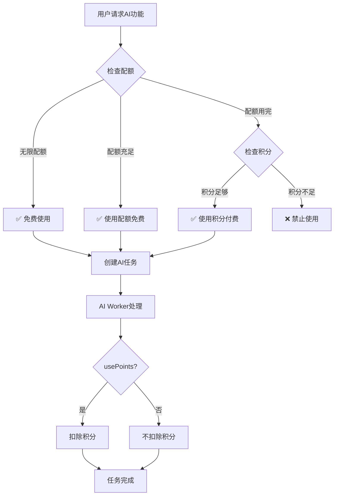

# AI创作辅助功能：配额+积分混合模式实现

## 📋 实现概述

**功能：** 实现AI创作辅助功能的配额+积分混合消耗模式  
**版本：** v1.0  
**日期：** 2026-03-18  
**状态：** ✅ 已完成

---

## 🎯 功能需求

根据 `docs/points-consumption-system-design.md` 第一阶段要求，实现：

### **核心功能**

1. **AI续写** - 10积分/次（超配额）
2. **AI润色** - 3积分/次（超配额）
3. **AI插图** - 20积分/张（超配额）
4. **AI加急** - 5积分/次（待实现）

### **消耗规则**

- ✅ **配额充足时**：使用配额（免费）
- ✅ **配额用完时**：使用积分（付费）
- ✅ **积分不足时**：禁止使用并提示

---

## 🔧 技术实现

### **1. 核心函数改造**

#### **文件：** `api/src/utils/points.ts`

#### **改造前（旧逻辑）**

```typescript
export async function canUseAiFeature(
  userId: number,
  featureType: 'continuation' | 'polish' | 'illustration'
): Promise<{ allowed: boolean; reason?: string }> {
  // ❌ 问题：配额用完直接返回错误，没有检查积分
  if (feature.used >= feature.limit) {
    return {
      allowed: false,
      reason: `本月配额已用完`
    };
  }
  return { allowed: true };
}
```

#### **改造后（新逻辑）**

```typescript
export async function canUseAiFeature(
  userId: number,
  featureType: 'continuation' | 'polish' | 'illustration'
): Promise<{ 
  allowed: boolean; 
  usePoints: boolean;      // 是否需要使用积分
  pointsCost: number;      // 需要消耗的积分数
  quotaRemaining: number;  // 剩余配额
  reason?: string 
}> {
  const quota = await getUserMonthlyQuota(userId);
  const feature = quota[featureType];
  const cost = AI_COST[featureType.toUpperCase()];

  // 情况1：无限配额（会员/管理员）
  if (feature.unlimited) {
    return { 
      allowed: true, 
      usePoints: false, 
      pointsCost: 0,
      quotaRemaining: -1
    };
  }

  const remaining = feature.limit - feature.used;

  // 情况2：配额充足，使用配额（免费）
  if (remaining > 0) {
    return { 
      allowed: true, 
      usePoints: false, 
      pointsCost: 0,
      quotaRemaining: remaining
    };
  }

  // 情况3：配额用完，检查积分
  const hasPoints = await hasEnoughPoints(userId, cost);
  
  if (hasPoints) {
    // ✅ 积分足够，允许使用（消耗积分）
    return { 
      allowed: true, 
      usePoints: true, 
      pointsCost: cost,
      quotaRemaining: 0
    };
  }

  // 情况4：配额和积分都不够
  return {
    allowed: false,
    usePoints: false,
    pointsCost: 0,
    quotaRemaining: 0,
    reason: `本月配额已用完且积分不足（需要${cost}积分）`
  };
}
```

---

### **2. AI任务创建改造**

#### **文件：** `api/src/routes/ai-v2.ts`

#### **改造点**

1. **调用权限检查**：获取 `usePoints` 和 `pointsCost` 信息
2. **保存到任务**：将消耗信息存入 `input_data` 字段
3. **前端提示**：返回是否需要消耗积分的信息

#### **示例：AI续写任务创建**

```typescript:40:60:api/src/routes/ai-v2.ts
try {
  // 检查权限（配额+积分混合模式）
  const permission = await canUseAiFeature(userId, 'continuation');
  if (!permission.allowed) {
    return res.status(403).json({ error: permission.reason });
  }

  // 创建任务记录（保存是否需要使用积分）
  const task = await prisma.ai_tasks.create({
    data: {
      user_id: userId,
      story_id: parseInt(storyId),
      task_type: 'continuation',
      status: 'pending',
      input_data: JSON.stringify({
        context: fullContext,
        style,
        count,
        usePoints: permission.usePoints,      // ✅ 保存是否使用积分
        pointsCost: permission.pointsCost,    // ✅ 保存积分消耗
        quotaRemaining: permission.quotaRemaining // ✅ 保存剩余配额
      })
    }
  });

  res.json({
    taskId: task.id,
    status: 'pending',
    usePoints: permission.usePoints,          // ✅ 返回给前端
    pointsCost: permission.pointsCost
  });
}
```

---

### **3. AI Worker改造**

#### **文件：** `api/src/workers/aiWorker.ts`

#### **改造点**

根据任务中保存的 `usePoints` 标志，决定是否扣除积分。

#### **示例：AI续写Worker**

```typescript:407:427:api/src/workers/aiWorker.ts
// 根据任务设置决定是否扣除积分
const inputData = JSON.parse(task.input_data || '{}');
const usePoints = inputData.usePoints || false;
const pointsCost = inputData.pointsCost || AI_COST.CONTINUATION;

if (usePoints) {
  // 配额用完，使用积分
  console.log(`💰 配额已用完，扣除${pointsCost}积分`);
  const deductResult = await deductPoints(
    userId, 
    pointsCost, 
    'ai_continuation', 
    'AI续写消耗积分', 
    taskId
  );
  
  if (!deductResult.success) {
    console.error(`❌ 扣除积分失败，用户积分不足`);
    // 任务已执行，不回滚，但记录警告
  }
} else {
  // 使用配额，不扣除积分
  console.log(`✅ 使用配额，不扣除积分（剩余: ${inputData.quotaRemaining}）`);
}
```

---

## 📊 消耗逻辑流程图



---

## 🎯 使用场景示例

### **场景1：新手作者（Lv1）**

**配额：** 续写5次/月，润色10次/月，插图2张/月  
**积分：** 60分

#### **第1次使用AI续写**
```json
{
  "allowed": true,
  "usePoints": false,
  "pointsCost": 0,
  "quotaRemaining": 4
}
```
✅ 使用配额（免费），剩余4次

---

#### **第6次使用AI续写（配额用完）**
```json
{
  "allowed": true,
  "usePoints": true,
  "pointsCost": 10,
  "quotaRemaining": 0
}
```
✅ 使用积分（消耗10分），剩余50分

---

#### **第7次使用AI续写（积分不足）**
```json
{
  "allowed": false,
  "usePoints": false,
  "pointsCost": 0,
  "quotaRemaining": 0,
  "reason": "本月AI续写配额已用完（5/5），且积分不足（需要10积分）"
}
```
❌ 禁止使用，需要充值积分或等待下月

---

### **场景2：活跃作者（Lv2）**

**配额：** 续写15次/月，润色30次/月，插图5张/月  
**积分：** 500分

#### **月度使用**
- 前15次续写：使用配额（免费）
- 第16-20次续写：使用积分（消耗50分）
- 剩余积分：450分 ✅

---

### **场景3：会员用户**

**配额：** 续写无限，润色无限，插图100张/月  
**积分：** 1000分

#### **任何时候使用**
```json
{
  "allowed": true,
  "usePoints": false,
  "pointsCost": 0,
  "quotaRemaining": -1  // -1表示无限
}
```
✅ 永远使用配额（免费），不消耗积分

---

## 📈 数据监控

### **需要监控的指标**

1. **配额使用率**
   - 各等级用户的配额使用情况
   - 配额用完的用户占比

2. **积分消耗**
   - 超配额使用的次数
   - 积分消耗的总量
   - 积分不足被拦截的次数

3. **用户转化**
   - 配额用完后继续使用的用户占比
   - 积分购买转化率

### **SQL查询示例**

```sql
-- 查询本月超配额使用积分的次数
SELECT 
  COUNT(*) as over_quota_count,
  SUM(CAST(input_data::json->>'pointsCost' AS INTEGER)) as total_points_used
FROM ai_tasks
WHERE 
  created_at >= DATE_TRUNC('month', CURRENT_DATE)
  AND input_data::json->>'usePoints' = 'true';

-- 查询各用户的配额使用情况
SELECT 
  u.username,
  u.level,
  COUNT(*) as usage_count,
  SUM(CASE WHEN t.input_data::json->>'usePoints' = 'true' THEN 1 ELSE 0 END) as over_quota_count
FROM ai_tasks t
JOIN users u ON t.user_id = u.id
WHERE t.created_at >= DATE_TRUNC('month', CURRENT_DATE)
GROUP BY u.id, u.username, u.level
ORDER BY usage_count DESC;
```

---

## ✅ 测试验证

### **测试用例**

#### **1. 配额充足时使用**
```bash
# 用户配额：续写5次/月，已使用0次
# 预期：使用配额，不扣积分

curl -X POST http://localhost:3001/api/ai/v2/continuation/submit \
  -H "Authorization: Bearer $TOKEN" \
  -H "Content-Type: application/json" \
  -d '{
    "storyId": 1,
    "context": "测试内容",
    "count": 3
  }'

# 预期响应
{
  "taskId": 123,
  "status": "pending",
  "usePoints": false,
  "pointsCost": 0
}
```

---

#### **2. 配额用完后使用**
```bash
# 用户配额：续写5次/月，已使用5次
# 用户积分：100分
# 预期：使用积分，扣除10分

curl -X POST http://localhost:3001/api/ai/v2/continuation/submit \
  -H "Authorization: Bearer $TOKEN" \
  -H "Content-Type: application/json" \
  -d '{
    "storyId": 1,
    "context": "测试内容",
    "count": 3
  }'

# 预期响应
{
  "taskId": 124,
  "status": "pending",
  "usePoints": true,
  "pointsCost": 10
}

# 验证：查询用户积分
SELECT points FROM users WHERE id = $USER_ID;
# 预期：90分（100 - 10）
```

---

#### **3. 配额和积分都不足**
```bash
# 用户配额：续写5次/月，已使用5次
# 用户积分：5分（不足10分）
# 预期：拒绝使用

curl -X POST http://localhost:3001/api/ai/v2/continuation/submit \
  -H "Authorization: Bearer $TOKEN" \
  -H "Content-Type: application/json" \
  -d '{
    "storyId": 1,
    "context": "测试内容",
    "count": 3
  }'

# 预期响应（403错误）
{
  "error": "本月AI续写配额已用完（5/5），且积分不足（需要10积分）"
}
```

---

#### **4. 会员用户使用**
```bash
# 用户类型：会员（无限配额）
# 预期：永远使用配额，不扣积分

curl -X POST http://localhost:3001/api/ai/v2/continuation/submit \
  -H "Authorization: Bearer $TOKEN" \
  -H "Content-Type: application/json" \
  -d '{
    "storyId": 1,
    "context": "测试内容",
    "count": 3
  }'

# 预期响应
{
  "taskId": 125,
  "status": "pending",
  "usePoints": false,
  "pointsCost": 0
}
```

---

## 🎉 实现效果

### **✅ 已实现功能**

1. **配额检查**：准确判断用户配额使用情况
2. **积分检查**：配额用完后检查积分是否足够
3. **智能扣费**：根据情况决定使用配额或积分
4. **透明提示**：清晰告知用户消耗方式
5. **数据记录**：完整记录配额和积分使用情况

---

### **📊 预期效果**

1. **用户体验提升**
   - 新手用户有足够配额体验核心功能
   - 重度用户可以用积分继续使用
   - 消耗透明，用户可预期

2. **商业价值**
   - 鼓励用户充值积分
   - 引导用户购买会员
   - 形成健康的积分经济

3. **平台运营**
   - 控制AI成本
   - 提升用户活跃度
   - 增加付费转化率

---

## 🚀 下一步计划

### **第二阶段：其他积分消耗功能**

根据 `docs/points-consumption-system-design.md`，接下来实现：

1. **故事置顶** - 50积分/天
2. **打赏作者** - 最低5积分
3. **置顶评论** - 10积分/条

### **第三阶段：前端优化**

1. **配额显示**：在AI功能按钮旁显示剩余配额
2. **消耗提示**：使用积分时弹窗确认
3. **积分商城**：提供积分充值入口
4. **数据统计**：个人中心显示AI使用统计

---

## 📝 总结

### **核心价值**

✅ **灵活性**：配额+积分双轨制，满足不同用户需求  
✅ **公平性**：新手有基础配额，重度用户可付费使用  
✅ **可持续性**：控制成本，引导付费，形成良性循环  
✅ **用户友好**：透明消耗，清晰提示，体验良好

### **技术亮点**

- 权限检查函数返回详细信息（usePoints, pointsCost, quotaRemaining）
- 任务创建时保存消耗信息到 `input_data`
- Worker根据保存的信息决定是否扣除积分
- 完整的错误处理和日志记录

---

**配额+积分混合模式已成功实现，为平台的积分经济体系奠定了坚实基础！** 🎉

