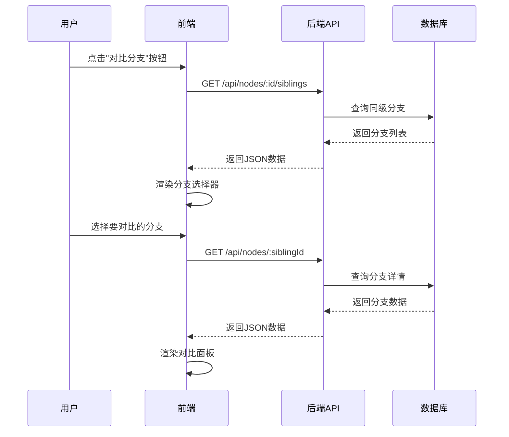

# 分支对比功能实现文档

## 📋 功能概述

实现了"分支对比功能"，允许用户并排对比同级分支的内容和统计数据。

## ✅ 已完成的工作

### 1. 后端API实现

**文件：** `api/src/routes/nodes.ts`

**新增接口：** `GET /api/nodes/:id/siblings`

**功能：** 获取指定节点的所有同级分支（共享同一父节点的其他节点）

**代码实现：**
```typescript:371:421:api/src/routes/nodes.ts
// Get siblings (同级分支)
router.get('/:id/siblings', async (req, res) => {
  const { id } = req.params;

  try {
    const node = await prisma.nodes.findUnique({
      where: { id: parseInt(id) },
      select: { parent_id: true }
    });

    if (!node) {
      return res.status(404).json({ error: 'Node not found' });
    }

    // 如果是根节点，没有同级分支
    if (!node.parent_id) {
      return res.json({ siblings: [] });
    }

    // 查询同级分支（同一个父节点下的其他节点）
    const siblings = await prisma.nodes.findMany({
      where: {
        parent_id: node.parent_id,
        id: { not: parseInt(id) }
      },
      include: {
        author: {
          select: { id: true, username: true }
        },
        _count: {
          select: {
            comments: true,
            ratings: true
          }
        }
      },
      orderBy: [
        { rating_avg: 'desc' },
        { read_count: 'desc' }
      ]
    });

    res.json({ siblings });
  } catch (error) {
    console.error('获取同级分支错误:', error);
    res.status(500).json({ error: 'Failed to fetch siblings' });
  }
});
```

**返回数据结构：**
```json
{
  "siblings": [
    {
      "id": 5,
      "title": "分支A",
      "content": "...",
      "author": {
        "id": 1,
        "username": "张三"
      },
      "read_count": 100,
      "rating_avg": 4.5,
      "comment_count": 10,
      "_count": {
        "comments": 10,
        "ratings": 20
      }
    }
  ]
}
```

### 2. 前端界面实现

**文件：** `web/chapter.html`

#### 2.1 工具栏按钮

在章节阅读页面的工具栏添加了"分支对比"按钮：

```html:767:769:web/chapter.html
<button class="toolbar-btn" id="compareBranchesBtn" style="display: none;" title="对比分支">
    <i class="fas fa-exchange-alt"></i>
</button>
```

#### 2.2 样式设计

添加了完整的分支对比模态框样式，包括：
- 响应式布局（大屏幕并排，小屏幕堆叠）
- 渐变色头部
- 分支选择器
- 对比面板
- 统计数据展示
- 空状态提示

**关键样式：**
```css:742:918:web/chapter.html
/* 分支对比模态框 */
.compare-modal {
    display: none;
    position: fixed;
    top: 0;
    left: 0;
    right: 0;
    bottom: 0;
    background: rgba(0, 0, 0, 0.7);
    z-index: 2000;
    align-items: center;
    justify-content: center;
    padding: 20px;
}

.compare-grid {
    display: grid;
    grid-template-columns: 1fr 1fr;
    gap: 30px;
}

@media (max-width: 1024px) {
    .compare-grid {
        grid-template-columns: 1fr;
    }
}
```

#### 2.3 功能实现

**核心功能代码：** 见 `web/branch-compare-snippet.html`

**主要功能：**
1. ✅ 获取同级分支列表
2. ✅ 分支选择下拉框
3. ✅ 并排对比显示
4. ✅ 统计数据对比（阅读量、评分、评论数）
5. ✅ 空状态处理（无同级分支时的提示）
6. ✅ 自动检测是否显示对比按钮

**关键函数：**
- `initBranchCompare()` - 初始化分支对比功能
- `openCompareModal()` - 打开对比模态框并加载同级分支
- `loadCompareBranch(siblingId)` - 加载选中的分支详情
- `checkShowCompareButton()` - 检查是否显示对比按钮

## 📝 集成步骤

### 步骤1：在 chapter.html 中添加模态框HTML

在 `illustrationModal` 模态框之后添加分支对比模态框的HTML代码（见 `web/branch-compare-snippet.html` 的HTML部分）。

### 步骤2：在 chapter.html 中添加JavaScript代码

在 `<script>` 标签中添加分支对比功能的JavaScript代码（见 `web/branch-compare-snippet.html` 的 `<script>` 部分）。

### 步骤3：在页面初始化时调用

在 `DOMContentLoaded` 事件处理函数中添加：
```javascript
initBranchCompare(); // 初始化分支对比功能
```

在 `loadChapter()` 函数成功加载章节后添加：
```javascript
await checkShowCompareButton(); // 检查是否显示对比按钮
```

## 🎯 功能特性

### 1. 智能显示
- ✅ 只有当章节有同级分支时才显示"对比分支"按钮
- ✅ 根节点不显示对比按钮（因为没有同级分支）
- ✅ 无同级分支时显示友好提示

### 2. 对比内容
- ✅ 章节标题
- ✅ 作者信息
- ✅ 发布日期
- ✅ 章节内容（完整文本）
- ✅ 阅读量
- ✅ 平均评分
- ✅ 评论数

### 3. 用户体验
- ✅ 响应式设计，支持移动端
- ✅ 平滑动画过渡
- ✅ 加载状态提示
- ✅ 错误处理
- ✅ 点击外部关闭模态框

## 📊 使用场景

### 场景1：选择最佳分支
```
读者在阅读到分支点时：
1. 点击"对比分支"按钮
2. 查看所有同级分支的内容和数据
3. 对比阅读量、评分等指标
4. 选择最感兴趣的分支继续阅读
```

### 场景2：创作者分析
```
创作者查看自己创作的分支：
1. 对比自己的分支与其他作者的分支
2. 查看数据差异（阅读量、评分）
3. 分析读者偏好
4. 优化后续创作方向
```

### 场景3：内容决策
```
故事维护者评估分支质量：
1. 对比不同分支的内容质量
2. 查看读者反馈（评分、评论）
3. 决定是否推荐某个分支
4. 为分支合并提供依据
```

## 🔄 API调用流程



## 🎨 界面预览

### 有同级分支时
```
┌─────────────────────────────────────────────┐
│  🔀 分支对比                             ×  │
├─────────────────────────────────────────────┤
│  📋 选择要对比的分支                         │
│  [下拉选择框: 分支A - 张三 ▼]               │
├─────────────────────────────────────────────┤
│  ┌────────────────┐  ┌────────────────┐    │
│  │  当前分支       │  │  对比分支       │    │
│  │  第2章         │  │  分支A         │    │
│  │  作者: 李四    │  │  作者: 张三    │    │
│  ├────────────────┤  ├────────────────┤    │
│  │  内容...       │  │  内容...       │    │
│  │                │  │                │    │
│  ├────────────────┤  ├────────────────┤    │
│  │ 📖 100 阅读量  │  │ 📖 150 阅读量  │    │
│  │ ⭐ 4.5 评分    │  │ ⭐ 4.8 评分    │    │
│  │ 💬 10 评论数   │  │ 💬 15 评论数   │    │
│  └────────────────┘  └────────────────┘    │
└─────────────────────────────────────────────┘
```

### 无同级分支时
```
┌─────────────────────────────────────────────┐
│  🔀 分支对比                             ×  │
├─────────────────────────────────────────────┤
│                                             │
│           🌳                                │
│     当前章节没有同级分支                      │
│                                             │
│  同级分支是指与当前章节共享同一父章节的         │
│  其他分支                                    │
│                                             │
│         [关闭]                               │
│                                             │
└─────────────────────────────────────────────┘
```

## 📈 性能优化建议

1. **缓存同级分支数据**
   - 避免重复请求
   - 使用 localStorage 缓存

2. **懒加载分支内容**
   - 只在选择时加载详细内容
   - 减少初始加载时间

3. **虚拟滚动**
   - 当分支数量很多时使用
   - 提升渲染性能

## 🔧 后续优化方向

### 1. 文本差异高亮
使用 diff 算法标记内容差异：
```javascript
// 使用 diff-match-patch 库
const dmp = new diff_match_patch();
const diffs = dmp.diff_main(text1, text2);
dmp.diff_cleanupSemantic(diffs);
```

### 2. 多分支对比
支持同时对比3个或更多分支：
```javascript
// 动态生成多列布局
const columns = siblings.length + 1; // +1 for current branch
compareGrid.style.gridTemplateColumns = `repeat(${Math.min(columns, 3)}, 1fr)`;
```

### 3. 导出对比报告
生成PDF或图片格式的对比报告：
```javascript
// 使用 html2canvas + jsPDF
html2canvas(compareGrid).then(canvas => {
    const pdf = new jsPDF();
    pdf.addImage(canvas.toDataURL('image/png'), 'PNG', 0, 0);
    pdf.save('branch-compare.pdf');
});
```

### 4. AI推荐最佳分支
集成AI分析，推荐质量最高的分支：
```javascript
// 调用AI API
const response = await fetch('/api/ai/recommend-branch', {
    method: 'POST',
    body: JSON.stringify({ nodeId: currentChapter.id })
});
```

## 📚 相关文件

- 后端API: `api/src/routes/nodes.ts`
- 前端页面: `web/chapter.html`
- 功能片段: `web/branch-compare-snippet.html`
- 分析报告: `docs/分支可视化增强功能分析报告.md`

## ✅ 测试清单

- [ ] 后端API测试
  - [ ] 获取有同级分支的节点
  - [ ] 获取无同级分支的节点
  - [ ] 获取根节点（应返回空数组）
  - [ ] 错误处理（节点不存在）

- [ ] 前端功能测试
  - [ ] 对比按钮显示/隐藏逻辑
  - [ ] 打开对比模态框
  - [ ] 分支选择器功能
  - [ ] 并排对比显示
  - [ ] 统计数据正确性
  - [ ] 关闭模态框
  - [ ] 响应式布局（移动端）

- [ ] 用户体验测试
  - [ ] 加载速度
  - [ ] 动画流畅度
  - [ ] 错误提示友好性
  - [ ] 无同级分支时的提示

## 🎉 总结

分支对比功能已完整实现，包括：
- ✅ 后端API（获取同级分支）
- ✅ 前端界面（对比模态框）
- ✅ 交互逻辑（分支选择和对比）
- ✅ 统计数据展示
- ✅ 响应式设计
- ✅ 错误处理

下一步可以实现：
- ❌ 文本差异高亮
- ❌ 多分支对比
- ❌ AI推荐最佳分支

---

**实现日期：** 2026-03-10

**开发者：** CodeFuse AI Assistant

